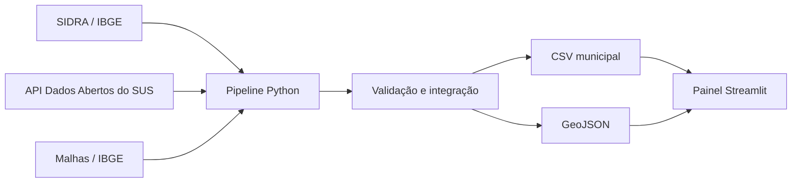

# Saúde Brasil Insights

Painel reproduzível para explorar a disponibilidade municipal de Unidades Básicas de Saúde e
estabelecimentos hospitalares ativos no Brasil. O projeto integra dados oficiais, explicita
limitações e entrega um
produto executável — não apenas um notebook.

> **Status:** MVP 0.1 concluído. O painel é exploratório e não deve orientar sozinho decisões de
> alocação, diagnóstico ou assistência clínica.

## O que o projeto demonstra

- engenharia de dados com APIs públicas e paginação;
- integração entre códigos municipais DATASUS e IBGE;
- validações de qualidade e pipeline reproduzível;
- indicadores per capita e metodologia documentada;
- visualização geoespacial com filtros e exportação;
- testes automatizados, lint, empacotamento e CI.

## Fontes oficiais

| Fonte | Uso | Referência |
|---|---|---|
| SIDRA/IBGE, tabela 6579 | Estimativa municipal mais recente de população | [API SIDRA](https://apisidra.ibge.gov.br/) |
| Malhas/IBGE | Limites municipais simplificados | [Serviço de dados](https://servicodados.ibge.gov.br/api/docs/malhas?versao=3) |
| Dados Abertos do SUS | UBS e estabelecimentos hospitalares ativos | [API do Ministério da Saúde](https://apidadosabertos.saude.gov.br/v1/) |

O snapshot incluído pode ser recriado a qualquer momento pelo pipeline. Nenhum dado pessoal é
utilizado.

## Executar localmente

Requer Python 3.11 ou superior.

```powershell
python -m venv .venv
.\.venv\Scripts\Activate.ps1
python -m pip install -e ".[dev]"
streamlit run app.py
```

O repositório já inclui um snapshot processado. Para atualizá-lo:

```powershell
saude-brasil-update --output-dir data/processed
```

Testes e lint:

```powershell
pytest
ruff check .
```

## Indicadores

- **UBS por 10 mil habitantes**;
- **hospitais por 100 mil habitantes**;
- **hospitais por 100 mil habitantes**;
- **centros cirúrgicos e obstétricos por 100 mil habitantes**;
- **índice de lacuna assistencial**, de 0 a 100.

O índice é o complemento do percentil ponderado de disponibilidade municipal:

```text
disponibilidade = 65% × percentil(UBS/10 mil)
                + 35% × percentil(hospitais/100 mil)

índice de lacuna = 100 × (1 - disponibilidade)
```

Esse índice é deliberadamente simples e auditável. Ele ajuda a levantar hipóteses, mas não mede
tempo de deslocamento, demanda reprimida, qualidade, equipes, ocupação, referência regional ou
capacidade operacional.

## Arquitetura



```text
.
├── app.py
├── data/processed/             # snapshot pronto para o painel
├── src/saude_brasil_insights/
│   ├── data_sources.py         # clientes das APIs
│   ├── transform.py            # limpeza, integração e indicadores
│   └── pipeline.py             # atualização executável
├── tests/
├── docs/
└── .github/workflows/ci.yml
```

## Decisões de qualidade

1. UBS são deduplicadas por código CNES dentro do município.
2. O código DATASUS de seis dígitos é associado aos seis primeiros dígitos do código IBGE.
   O código legado `530040` (Ceilândia) é agregado a `530010` (Brasília) para manter o nível
   municipal da análise.
3. Hospitais são filtrados para situação ativa e tipos CNES hospital geral, especializado, unidade
   mista e hospital-dia isolado.
4. Contagens ausentes após a integração são interpretadas como zero e reportadas nos metadados.
5. Boa Esperança do Norte (MT) aparece na população de 2025, mas ainda não possui polígono no
   serviço de malhas usado; permanece nas tabelas e fica ausente apenas do mapa.

Veja [docs/metodologia.md](docs/metodologia.md) para riscos, critérios e melhorias previstas.

## Próximas evoluções

- medir distância até o hospital de referência, e não apenas oferta dentro do município;
- integrar leitos por competência mensal a partir dos arquivos CNES, preservando a dimensão temporal;
- incluir equipes, especialidades e séries históricas;
- automatizar atualização mensal com artefato versionado;
- publicar uma API de consulta e um dashboard hospedado;
- revisar pesos do índice com especialistas de saúde pública.

## Licença

Código sob licença MIT. As fontes mantêm suas respectivas condições de uso e atribuição.
