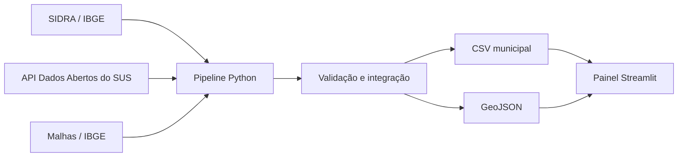

# Saúde Brasil Insights

[](https://github.com/pedropaulofernandes88-stack/saude-brasil-insights/actions/workflows/ci.yml)

## Demonstração ao vivo

[Explorar os 5.571 municípios no hub IA e Dados em Saúde](https://ia-dados-saude-pedro.pedropaulofernandes8.chatgpt.site/demos/saude-brasil-insights)

A demo web utiliza o snapshot municipal versionado e permite buscar, filtrar e ordenar indicadores.
O pipeline ETL, as análises de sensibilidade e a aplicação Streamlit completa permanecem neste
repositório.

Painel interativo e pipeline de dados para explorar diferenças na disponibilidade cadastrada de
Unidades Básicas de Saúde (UBS) e estabelecimentos hospitalares ativos entre os municípios
brasileiros.

O projeto nasceu de uma pergunta simples: **em quais municípios a oferta local cadastrada de
atenção básica e hospitais é relativamente menor quando comparada à população?** As respostas são
apresentadas em um mapa, rankings e tabelas filtráveis. O objetivo é gerar hipóteses para análise de
saúde pública, não diagnosticar sozinho um vazio assistencial.

A versão atual também publica uma análise de sensibilidade dos pesos e um proxy territorial da
distância geodésica até o município com hospital ativo mais próximo. O proxy não representa rota,
tempo de viagem ou disponibilidade de atendimento.

> **Uso responsável:** os indicadores são descritivos e exploratórios. Eles não medem qualidade,
> ocupação, equipes disponíveis, tempo de deslocamento ou funcionamento em tempo real e não devem
> orientar isoladamente decisões clínicas ou de alocação de recursos.

## Demonstração do produto

O painel permite:

- visualizar indicadores por município em um mapa do Brasil;
- filtrar por região, UF e população mínima;
- comparar UBS e hospitais por habitante;
- alternar seis cenários de ponderação e inspecionar estabilidade do ranking;
- explorar um proxy territorial disponível para 5.570 municípios;
- identificar municípios que merecem investigação adicional;
- consultar os dados consolidados e baixar o recorte em CSV;
- inspecionar fontes, regras de integração e controles de qualidade.

O snapshot incluído no repositório contém:

| Item | Quantidade |
|---|---:|
| Registros municipais com população de 2025 | 5.571 |
| UBS únicas | 46.848 |
| Estabelecimentos hospitalares ativos | 6.457 |
| Municípios com ao menos uma UBS | 5.480 |
| Municípios com ao menos um hospital | 2.868 |
| População consolidada | 213.421.037 |

Os valores são gerados pelo pipeline e registrados em
[`data/processed/metadata.json`](data/processed/metadata.json). Eles podem mudar quando as fontes
oficiais forem atualizadas.

## Tecnologias e competências demonstradas

- Python, Pandas, Requests, Streamlit e Plotly;
- consumo resiliente de APIs públicas paginadas;
- integração de identificadores DATASUS e IBGE;
- indicadores per capita e análise geoespacial;
- análise de sensibilidade e explicitação de incerteza metodológica;
- validação de dados, testes, lint e GitHub Actions;
- documentação metodológica e comunicação responsável de limitações.

## Fontes oficiais

| Fonte | Uso | Referência |
|---|---|---|
| SIDRA/IBGE — tabela 6579 | Estimativa municipal de população | [API SIDRA](https://apisidra.ibge.gov.br/) |
| Malhas/IBGE | Limites municipais simplificados | [API de Malhas](https://servicodados.ibge.gov.br/api/docs/malhas?versao=3) |
| Ministério da Saúde | UBS e estabelecimentos hospitalares ativos | [API de Dados Abertos](https://apidadosabertos.saude.gov.br/v1/) |

O painel utiliza apenas dados agregados ou cadastrais de estabelecimentos. Nenhum dado individual
de paciente é armazenado no repositório.

## Como executar

Requer Python 3.11 ou superior.

```powershell
git clone https://github.com/pedropaulofernandes88-stack/saude-brasil-insights.git
cd saude-brasil-insights
python -m venv .venv
.\.venv\Scripts\Activate.ps1
python -m pip install -e ".[dev]"
streamlit run app.py
```

O repositório inclui um snapshot processado, portanto o painel pode ser aberto sem baixar novamente
as bases nacionais.

Para reconstruir o snapshot usando as fontes oficiais:

```powershell
saude-brasil-update --output-dir data/processed
```

Para executar as verificações locais:

```powershell
pytest
ruff check .
```

Para reproduzir exatamente o ambiente validado, instale `requirements.lock`. A imagem Docker
executa o painel como usuário não privilegiado: `docker build -t saude-insights .` e
`docker run --rm -p 8501:8501 saude-insights`.

## Indicadores

- **UBS por 10 mil habitantes**;
- **hospitais por 100 mil habitantes**;
- **centros cirúrgicos por 100 mil habitantes**;
- **centros obstétricos por 100 mil habitantes**;
- **índice exploratório de lacuna assistencial**, de 0 a 100.

O índice combina a posição relativa de cada município no país:

```text
disponibilidade relativa = 65% × percentil(UBS por 10 mil)
                         + 35% × percentil(hospitais por 100 mil)

índice de lacuna = 100 × (1 - disponibilidade relativa)
```

Quanto maior o índice, menor é a disponibilidade local relativa dentro das duas dimensões do MVP.
Ele não representa probabilidade, necessidade clínica nem meta regulatória.

## Arquitetura



```text
.
├── app.py
├── data/processed/             # snapshot consumido pelo painel
├── docs/
│   ├── metodologia.md          # escopo, fórmulas e limitações
│   ├── fontes-e-dicionario.md  # linhagem e definição das colunas
│   └── validacao-e-qualidade.md
├── src/saude_brasil_insights/
│   ├── data_sources.py         # clientes das APIs
│   ├── transform.py            # integração e indicadores
│   └── pipeline.py             # atualização executável
├── tests/
└── .github/workflows/ci.yml
```

## Documentação

- [Metodologia e limitações](docs/metodologia.md)
- [Fontes e dicionário de dados](docs/fontes-e-dicionario.md)
- [Validação e qualidade](docs/validacao-e-qualidade.md)
- [Roadmap do portfólio](ROADMAP_PORTFOLIO.md)

## Próximas evoluções

- medir distância e tempo até o hospital de referência;
- integrar leitos por competência mensal, preservando a dimensão temporal;
- incluir equipes, especialidades, demanda e séries históricas;
- revisar os pesos do índice com especialistas de saúde pública;
- publicar uma API de consulta e hospedar o dashboard.

## Licença

O código está sob licença MIT. Cada fonte de dados mantém suas próprias condições de uso e
atribuição.
